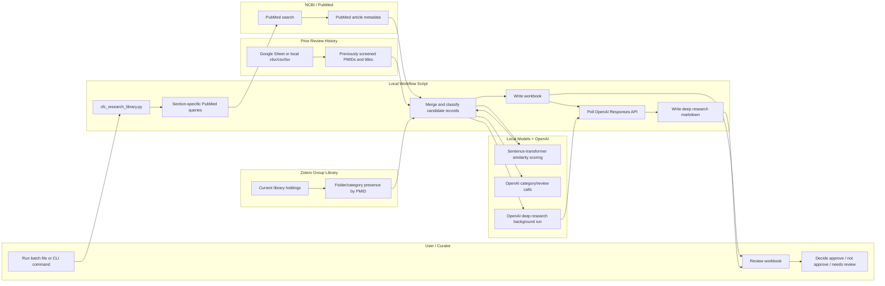
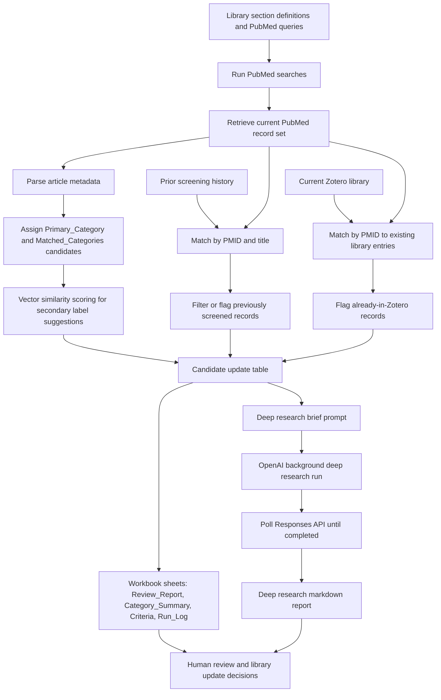

# CFC Research Library

This project updates a cardiofaciocutaneous syndrome research library by combining PubMed search results, prior human screening history, Zotero library state, vector-based category suggestions, and OpenAI-assisted review outputs into a review workbook for curators.

The main workflow is designed for a rare disease organization that needs to:

- rerun topic-specific PubMed searches across the library's Zotero sections
- avoid re-screening articles that were already reviewed in prior update rounds
- compare new PubMed hits against the current Zotero library
- generate structured update suggestions for human review
- submit a deep research brief and save the returned report as markdown next to the workbook

It started as a Colab notebook and is now a reusable local Python program.

## What The Workflow Produces

A standard library update run produces:

- an Excel workbook with candidate articles, category suggestions, screening fields, and run metadata
- an OpenAI deep research prompt stored inside the workbook
- a markdown deep research report written beside the workbook after the Responses API result is retrieved

Typical outputs:

- `reports/CFC_All_Categories_Master_Review_Report.xlsx`
- `reports/CFC_All_Categories_Master_Review_Report_deep_research.md`

## Workflow Overview

### Systems Swimlane



### Information Flow



## Setup

Install the Python libraries:

```powershell
python -m pip install -r requirements.txt
```

Set credentials as environment variables. You can copy `.env.example` as a reference, but keep real keys out of git.

Required:

- `ENTREZ_EMAIL`
- `ZOTERO_GROUP_ID`
- `ZOTERO_API_KEY`
- `OPENAI_API_KEY`

Optional:

- `OPENAI_DEEP_RESEARCH_MODEL`
- `OPENAI_DEEP_RESEARCH_TIMEOUT_SECONDS`
- `OPENAI_DEEP_RESEARCH_POLL_INTERVAL_SECONDS`

## How To Use It For A Library Update

A normal update cycle is:

1. Start from the current Zotero library and prior screening history.
2. Run the script for one category or all categories.
3. Let the script retrieve new PubMed results, compare them against Zotero and prior history, and write the workbook.
4. Wait for the deep research background run to complete; the script now polls the Responses API after workbook creation.
5. Review both the workbook and the generated markdown report.
6. Use the workbook to decide which articles should be added to Zotero, excluded, or escalated for human review.

The script is intended to support human curation, not replace it. Reviewers should make the final inclusion and categorization decisions.

## Run

Easiest option on Windows:

1. Create a local `.env` file using `.env.example` as the template.
2. Add your real `ENTREZ_EMAIL`, `ZOTERO_GROUP_ID`, `ZOTERO_API_KEY`, and `OPENAI_API_KEY`.
3. Double-click `Run CFC Research Update.bat`.

The launcher creates or reuses the local Python environment, installs the required libraries, filters out previously screened articles from the default Google Sheets history, searches for articles published from 2025 onward, runs all categories, submits OpenAI deep research, writes the workbook, polls for the deep research result, and writes the markdown report.

Command-line example for one category:

```powershell
python cfc_research_library.py --category Dermatology --output reports/Dermatology_Master_Review_Report.xlsx
```

To export one combined workbook for every category while preserving category labels:

```powershell
uv run python cfc_research_library.py --all-categories --since-year 2025 --output reports/CFC_All_Categories_Master_Review_Report.xlsx
```

The combined workbook keeps `Primary_Category` and `Matched_Categories` columns so reviewers can filter or sort by the original library sections. By default, this command searches publication dates from 2025 onward, reads the prior Google Sheets screening history, filters out already-screened papers, submits an OpenAI deep research run, and waits for the markdown report to be returned.

The prior screening history defaults to:

`https://docs.google.com/spreadsheets/d/1BUvWcV6XgYiOL3cCrYAHjkccb24C38OK/edit?usp=sharing&ouid=106518116377917721454&rtpof=true&sd=true`

To use a different prior screening file:

```powershell
uv run python cfc_research_library.py --all-categories --since-year 2025 --output reports/CFC_All_Categories_Master_Review_Report.xlsx --screening-history "C:\path\to\screening_history.xlsx"
```

If the Google Sheet is not publicly downloadable, export it as `.xlsx`, `.csv`, or `.tsv` and pass the downloaded file path to `--screening-history`.

For testing only, you can skip OpenAI deep research:

```powershell
uv run python cfc_research_library.py --all-categories --since-year 2025 --output reports/CFC_All_Categories_Master_Review_Report.xlsx --skip-openai-deep-research
```

Useful categories include:

`Allergy and Immunology`, `Cardiology`, `Dermatology`, `Development and Behavior`, `Endocrinology`, `Gastroenterology`, `General and Reviews`, `Genetics`, `Growth`, `Gynecology`, `Neurology`, `Oncology`, `Ophthalmology`, `Orthopedic`, `Otolaryngology`, `Pulmonology`, `Research Studies`, `Seizures`, and `Treatments`.

## Output Files

The workbook contains:

- `Review_Report`: article-level screening list sorted by category, with category columns and reviewer decision first
- `Category_Summary`: article counts by primary category
- `Criteria`: library descriptions, inclusion criteria, exclusion criteria, and PubMed queries
- `Deep_Research_Brief`: a ready-to-use prompt for OpenAI deep research or an agent workflow
- `OpenAI_Run`: OpenAI response ID and submission status for the deep research job
- `Run_Log`: run metadata
- `Instructions`: user-facing notes

The markdown report contains the returned deep research narrative from the OpenAI Responses API. It is written in the same directory as the workbook, using the workbook stem plus `_deep_research.md`.

## Notes

The program preserves existing `Review_Status` and `Reviewer_Notes` when appending newly discovered PubMed records. API keys from the original notebook were intentionally moved to environment variables.

Eligibility labels are intentionally conservative. The script no longer auto-labels CFC mentions as `Screen in`; likely matches are marked `Needs human review`, while titles centered on another RASopathy, such as Costello syndrome without CFC in the title, are screened out unless there is clear CFC-specific evidence.

Reviewer decisions are separate from automated eligibility labels. In `Review_Report`, use the `Reviewer_Decision` dropdown:

- `Needs reviewed`: yellow
- `Approved`: green
- `Not approved`: red

The `Primary_Category` and `Matched_Categories` columns appear at the front of the sheet and are color coded by category.
